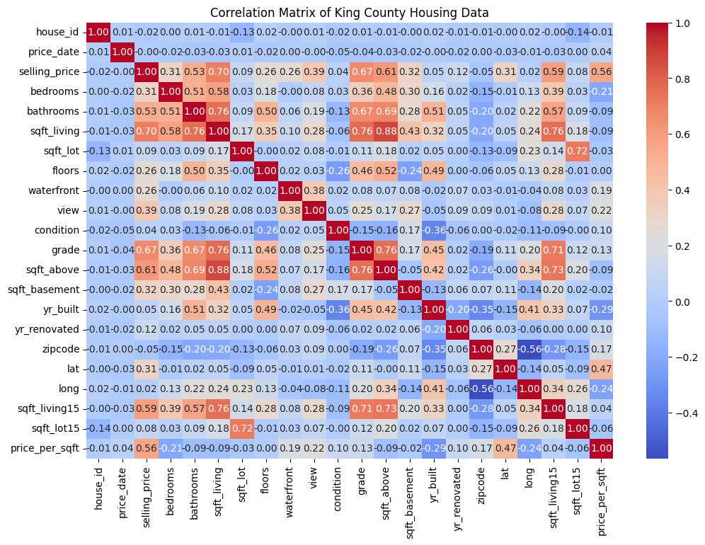
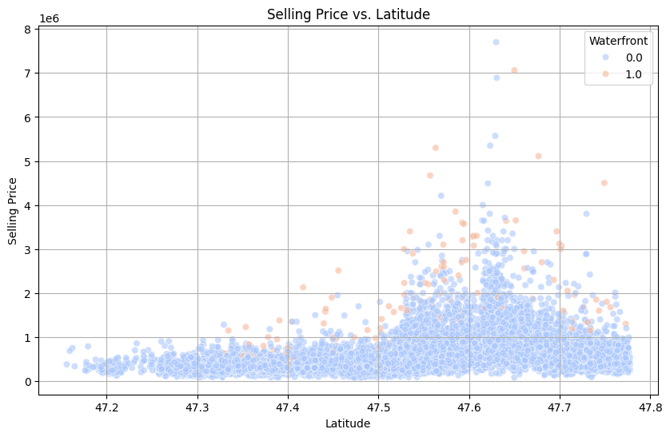
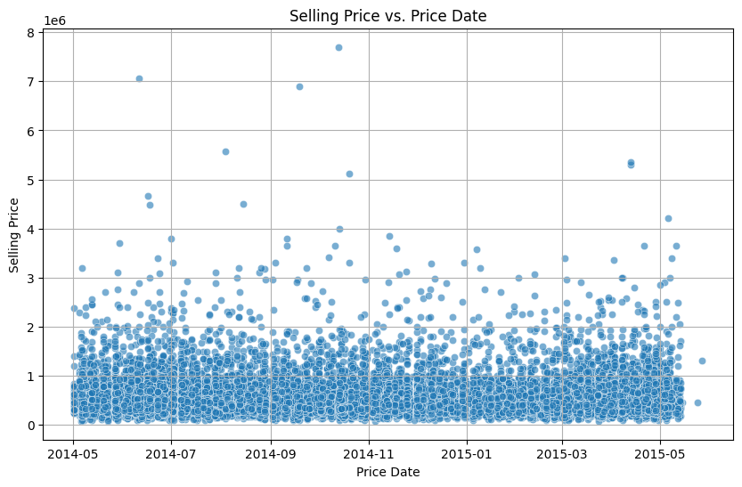
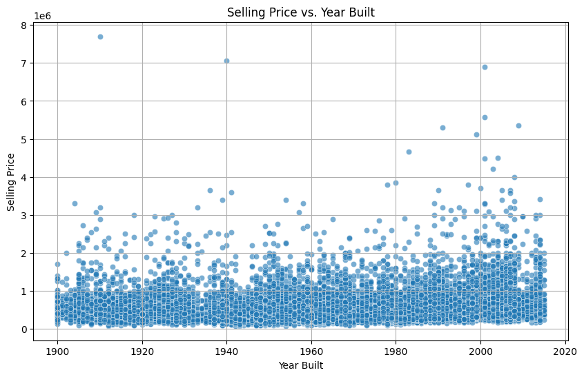
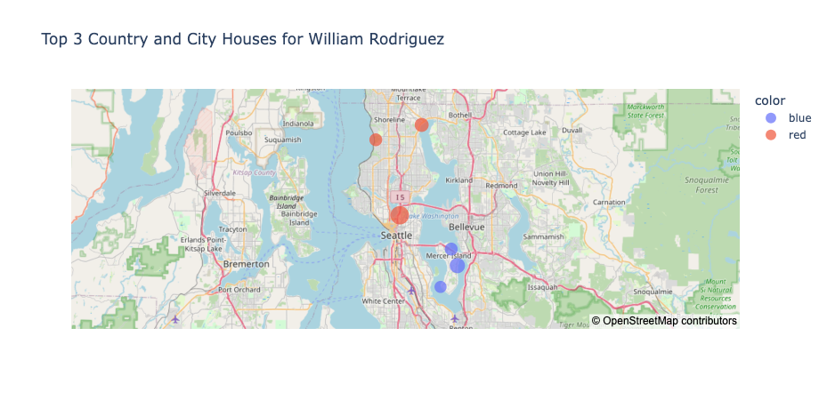

# Exploratory Data Analysis and Recommendations for King County Housing Market

**Tailored Insights for William Rodriguez**

*Presented by: Abhijit Paul*

*Date: 12.08.2024*

---
## Introduction

**Who You Are:**  
I am a Data Scientist specializing in real estate analytics.

**Who is Your Client:**  
William Rodriguez, a buyer interested in purchasing two properties: one country house and one city house.
- Country House: The purchase should be made at the best possible timing, focusing on non-renovated properties.
- City House: The property should be centrally located with a fast acquisition process.

**Objective:**  
Provide insights and recommendations for purchasing the ideal country and city houses based on the King County Housing Data.

---
## 2. Data Overview

**Data Source**: The data consists of housing sales in King County, USA.

**Time Span**: The data covers house sales from May 2014 to May 2015.

**Location**: King County, including prominent towns like Seattle, Bellevue, Sammamish, Redmond, and Mercer Island.

**Size of Data**: The dataset contains 21 columns, including information about house characteristics, prices, and locations.

---
## 3. Hypotheses Introduction

We formulated three main hypotheses to guide our analysis:

1. **Location's Effect on Price**:
   - Hypothesis: The closer a house is to the city center, the higher the price. Additionally, houses near water or in high-demand towns will have higher prices.

2. **Timing's Effect on Price**:
   - Hypothesis: Houses bought during peak seasons are more expensive, while prices drop in off-peak seasons.

3. **Condition's Effect on Price**:
   - Hypothesis: Renovated houses are priced higher than non-renovated ones, and older houses are priced lower unless renovated.

---
## Research Questions and Hypotheses

| Hypotheses                                                        | Indicators           |
|-------------------------------------------------------------------|----------------------|
| Does the location of a house affect the price?                    |                      |
| 1. The closer a house is to the city center, the higher the price | - geolocation        |
| 2. If a house is located near water, then the price is higher     | - waterfront (yes/no)|
|      | |
| Does the timing of purchase affect the price?                     |                      |
| 1. Houses bought during peak seasons are more expensive           | - purchase date      |
| 2. Prices drop in off-peak seasons                                | - seasonal trends    |
|      | |
| Does the condition of a house influence its price?                |                      |
| 1. Renovated houses are priced higher than non-renovated ones     | - yr_renovated       |
| 2. Older houses are priced lower unless renovated                 | - yr_built           |

---
## Data Cleaning and Preparation

**Steps taken to clean the data:**
1. Handling missing values (e.g., filling `NaN` with 0 for `yr_renovated`).
2. Addressing categorical variables (e.g., encoding `waterfront` and `view` columns).
3. Filtering relevant data (e.g., filtering for non-renovated houses, and houses in city and country locations).

---
## Correlation Matrix

---
## 4. Data Analysis

### 4.1 Location's Effect on Price

Below is a scatter plot that shows how the proximity to Seattle (city center) and the location in high-demand towns like Bellevue, Sammamish, and Mercer Island affect housing prices.

---

---

 - **Indicators**:
     - **Latitude (`lat`) and Longitude (`long`)**:
       - **Result**: `lat` has a positive correlation of 0.307 with the selling price, while `long` has a very weak correlation of 0.022.
       - **Interpretation**: The positive correlation with latitude suggests that houses located further north (which may correspond to more desirable or central locations) are associated with higher prices. However, the very weak correlation with longitude indicates that east-west positioning does not have a strong influence on price.

Observation: Properties in Seattle command higher prices, especially as square footage increases. Country houses in towns like Bellevue, Sammamish, and Mercer Island also show higher property values.

---

### 4.2 Timing's Effect on Price

Analysis of, whether seasonal trends affect housing prices by plotting the selling price against the date of sale.

---

---

- **Indicators**:
     - **Price Date (`price_date`)**:
       - **Result**: `price_date` has a very weak negative correlation of -0.004 with the selling price.
       - **Interpretation**: This very weak correlation suggests that the timing of the purchase (based on the date) does not significantly influence the price within the time frame of the dataset. This might indicate that within this dataset's period, the housing market was relatively stable, with no clear seasonal price trends.

Observation: The data did not show a strong seasonal trend, suggesting that the market is relatively stable year-round.

---
### 4.3 Condition's Effect on Price

This analysis looks at the impact of renovation status on housing prices. Comparison in prices of renovated vs. non-renovated houses.

---

---

 - **Indicators**:
     - **Year Renovated (`yr_renovated`)**:
       - **Result**: The `yr_renovated` feature has a weak positive correlation of 0.118 with the selling price.
       - **Interpretation**: Although there is a positive correlation, it's relatively weak, indicating that while renovation does have some impact on increasing house prices, it is not as strong a factor as expected. This could be due to various factors, such as the quality of renovation or the initial condition of the house.
     - **Year Built (`yr_built`)**:
       - **Result**: The `yr_built` feature has a very weak positive correlation of 0.054 with the selling price.
       - **Interpretation**: The weak positive correlation suggests that newer houses tend to have slightly higher prices, but this factor is not as significant. The age of the house alone is not a strong determinant of price unless it is combined with renovation.

Observation: Non-renovated houses, especially in the country, can be purchased at a lower price, offering potential for future value appreciation after renovations.

---

Additional based on Living Area: 

**Square Footage (`sqft_living`, `sqft_above`, `sqft_basement`)**:
     - **Result**: `sqft_living` has the highest positive correlation with selling price at 0.702, followed by `sqft_above` at 0.605, and `sqft_basement` at 0.321.
     - **Interpretation**: Larger homes are associated with higher prices.

---

## 5. Insights and Recommendations

### For the Country House:

- **Best Timing**: The best timing to purchase a country house is now, given the stable market conditions.
- **Non-Renovated Properties**: Focus on non-renovated houses in towns like Sammamish, Redmond, or Mercer Island. These areas offer high-value properties at a lower price point.
- **Location**: Prioritize Mercer Island or Sammamish for a spacious, serene environment while being within a reasonable distance from urban amenities.

### For the City House:

- **Fast & Central Location**: Concentrate on properties within Seattle for quick access to city amenities and business hubs.
- **Property Size and Type**: Focus on properties with 2,000 to 4,000 sqft in Seattle for the best balance between price and central location.
---
## List of houses as per William's requirements

### 1. Top 3 Country Houses
| House ID    | Town          | Selling Price | Square Footage | Year Built | Why This is a Good Choice                                                                 |
|-------------|---------------|---------------|----------------|------------|------------------------------------------------------------------------------------------|
| 7558700030  | Mercer Island | 5300000.00    | 7390.00        | 1991       | Non-renovated large property in Mercer Island with 7390.0 sqft, priced at $5300000.00.   |
| 8106100105  | Mercer Island | 3850000.00    | 5770.00        | 1980       | Non-renovated large property in Mercer Island with 5770.0 sqft, priced at $3850000.00.   |
| 9362000040  | Mercer Island | 3400000.00    | 5230.00        | 2005       | Non-renovated large property in Mercer Island with 5230.0 sqft, priced at $3400000.00.   |

---

### 2. Top 3 City Houses

| House ID    | Town   | Selling Price | Square Footage | Why This is a Good Choice                                                                 |
|-------------|--------|---------------|----------------|------------------------------------------------------------------------------------------|
| 6762700020  | Seattle| 7700000.00    | 12050.00       | Centrally located property in Seattle with 12050.0 sqft, priced at $7700000.00.          |
| 7738500731  | Seattle| 4500000.00    | 6640.00        | Centrally located property in Seattle with 6640.0 sqft, priced at $4500000.00.           |
| 2303900100  | Seattle| 3800000.00    | 5510.00        | Centrally located property in Seattle with 5510.0 sqft, priced at $3800000.00.           |

---

### Geo-map of the recommended houses

---

## 6. Summary and Next Steps

- **Country House**: Mr. William Rodriguez should look for non-renovated properties in towns like Mercer Island, as per suggested in the top 3 table for country houses. The best timing is now, as waiting may not result in price reductions. These towns offer significant potential for value growth through renovations.

- **City House**: He should focus on acquiring a centrally located property in Seattle for fast access to amenities and strong investment potential, as per the top 3 city house table.

